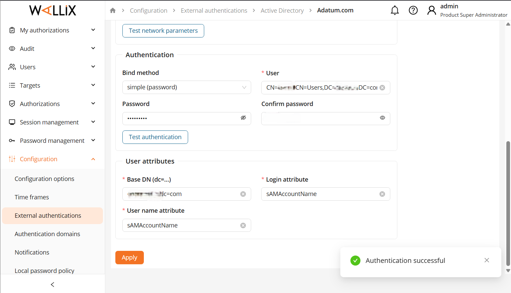
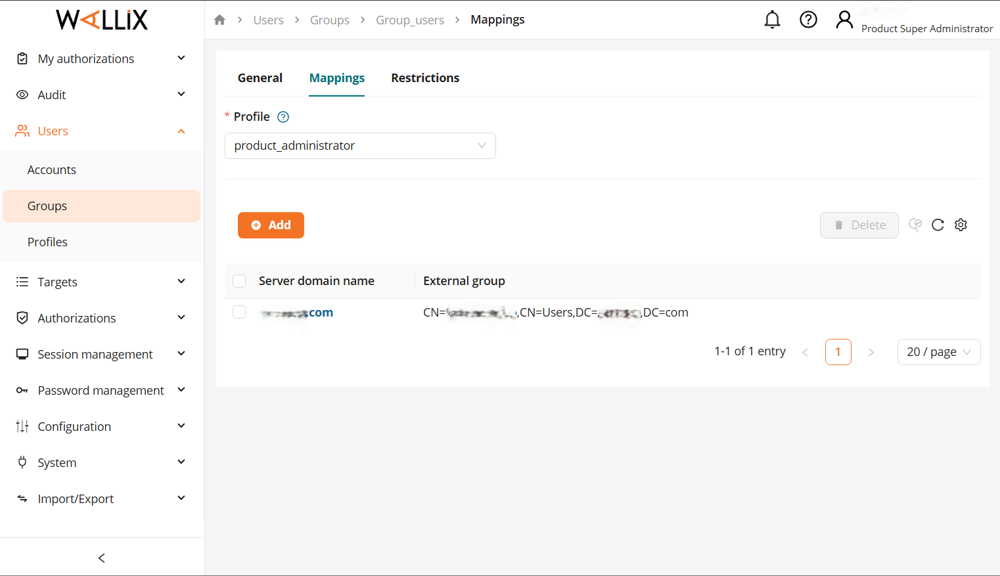
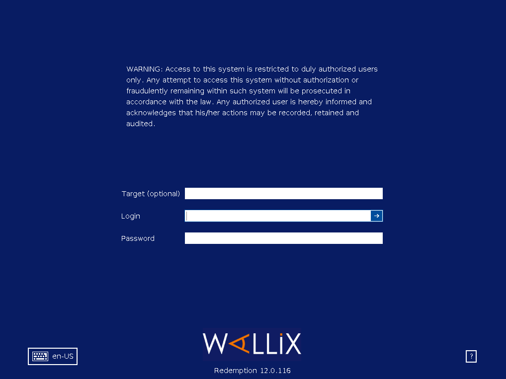

# 🔐 WALLIX Bastion Implementation & Active Directory Integration

## 📖 Project Overview
This project focuses on **Identity and Access Management (IAM)** by deploying a **WALLIX Bastion** to secure and monitor privileged access. The goal was to centralize authentication and enforce strict access control policies for IT infrastructure.

I successfully deployed the Bastion, configured local and domain authentication, and integrated it with an **Active Directory** environment to streamline user management.

## 🏗️ Architecture
* **PAM Solution:** WALLIX Bastion (Version 12.8.6)
* **Directory Service:** Windows Active Directory (AD)
* **Protocols Managed:** RDP, SSH
* **Target Infrastructure:** Windows Servers, Linux Assets

---

## 🛠️ Key Configurations Implemented

### 1. Active Directory Integration 🔗
Instead of managing local users manually, I integrated the Bastion with the corporate Active Directory. This required configuring the LDAP binding to the Domain Controller and verifying the connection.

*Evidence: Successful authentication connection between WALLIX Bastion and the AD Domain Controller.*

### 2. Access Control Logic (RBAC)
I implemented Role-Based Access Control (RBAC) by mapping external AD security groups to internal Bastion profiles.
* **Source:** AD Group `CN=Group,CN=Users,DC=Domain,DC=com`
* **Destination:** Bastion Profile `product_administrator`

*Evidence: Mapping external identity groups to internal security profiles.*

### 3. Secure Session Management
Users authenticate against the Bastion using their standard domain credentials. The Bastion then proxies the connection to the target server, ensuring the actual target credentials are never exposed to the end-user.

*Evidence: The WALLIX monitored login portal protecting access to the target Windows Server.*

---

## 🚀 Skills Demonstrated
* **PAM Administration:** Understanding the lifecycle of privileged sessions.
* **Identity Security:** Centralizing authentication via LDAP/AD.
* **Policy Enforcement:** Defining granular access rules (Who accesses What, When, and How).
* **Infrastructure Management:** Network configuration and service integration.

## 🔮 Future Improvements
* Integration with **SIEM** (Splunk) for log forwarding.
* Configuring **SMTP** for real-time alert notifications.
